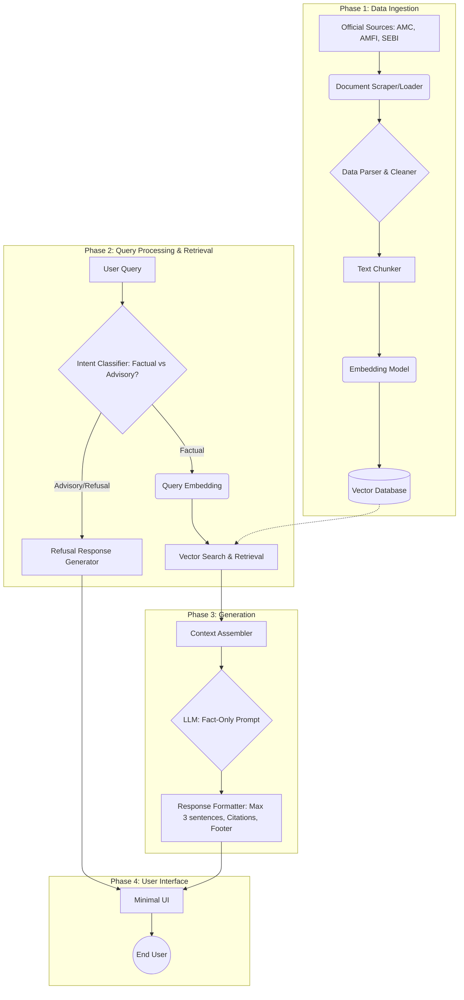
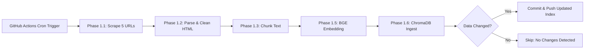

# Phase-Wise Architecture: Mutual Fund FAQ Assistant

This document outlines the detailed, phase-wise architecture for the Mutual Fund FAQ Assistant, a lightweight Retrieval-Augmented Generation (RAG) system designed to answer factual queries based on official AMC data.

## High-Level Architecture Diagram

---

## Phase 0: Target Schemes & Knowledge Base
**Objective:** Define the specific mutual fund schemes that will constitute the knowledge base.

For this project, the chosen Asset Management Company (AMC) is HDFC, and the following specific schemes from Groww will be indexed:
*   [HDFC Mid-Cap Opportunities Fund](https://groww.in/mutual-funds/hdfc-mid-cap-fund-direct-growth)
*   [HDFC Flexi Cap Fund](https://groww.in/mutual-funds/hdfc-equity-fund-direct-growth)
*   [HDFC Focused 30 Fund](https://groww.in/mutual-funds/hdfc-focused-fund-direct-growth)
*   [HDFC ELSS Tax Saver Fund](https://groww.in/mutual-funds/hdfc-elss-tax-saver-fund-direct-plan-growth)
*   [HDFC Top 100 Fund](https://groww.in/mutual-funds/hdfc-large-cap-fund-direct-growth)

---

## Phase 1: Data Ingestion & Preprocessing
**Objective:** Collect, process, and index the curated corpus of official mutual fund documents to enable accurate retrieval.

### Subphase 1a: Web Scraping & Sourcing
*   **Action:** Implement a scraping script to fetch HTML content from the 5 Groww URLs defined in Phase 0.
*   **Constraints:** Strictly limited to those 5 URLs. No external or linked pages will be followed.
*   **Output:** Save raw HTML files locally for debugging and as a backup.

### Subphase 1b: HTML Parsing & Data Cleaning
*   **Action:** Parse the raw HTML using tools like `BeautifulSoup`. Extract the main text body containing the scheme details (expense ratio, exit load, etc.).
*   **Cleaning:** Strip out boilerplate navigation, footers, ad banners, and inline scripts.
*   **Output:** Clean text documents associated with their respective metadata (Source URL, Last Updated Date).

### Subphase 1c: Text Chunking
*   **Action:** Break the cleaned flat text into smaller, overlapping segments suitable for the embedding window.
*   **Strategy:** Since the scraped HTML is flattened into plain text, use a fixed-size character chunker with paragraph awareness (e.g., chunk size of ~1000 characters / ~250 tokens, with ~100 characters of overlap) rather than a Markdown splitter.
*   **Output:** A list of text chunks for each scheme.

### Subphase 1d: Embedding & Vector Indexing
*   **Action:** Given the extremely small reality of the dataset (exactly 94 total chunks), generate vector embeddings locally using a lightweight open-source model like HuggingFace `all-MiniLM-L6-v2` via `sentence-transformers` to avoid external API costs or latency.
*   **Storage:** Instead of deploying a full-blown Vector Database (like ChromaDB or Pinecone), store the embeddings using a simple local FAISS index or a Numpy array, alongside a JSON file mapping chunk indices to their metadata.
*   **Output:** A serialized local vector index (e.g., `index.faiss` or `.npy`) and a metadata mapping file (`metadata.json`) ready for Phase 2.

### Subphase 1e (Phase 1.5): BGE Optimized Embedding
*   **Action:** Re-generate the vector embeddings using the `BAAI/bge-small-en-v1.5` model. This model is explicitly fine-tuned for asymmetric retrieval tasks and naturally handles our 200-250 token chunks perfectly.
*   **Storage:** Create a new local numpy array (`embeddings_bge.npy`) in the index directory.
*   **Output:** An optimized vector index built with `bge-small-en-v1.5` for higher retrieval accuracy in Phase 2.

### Subphase 1f (Phase 1.6): ChromaDB Integration
*   **Action:** To strictly follow standard RAG architectural patterns, migrate the storage of the 94 chunks and their pre-computed embeddings into a robust Vector Database.
*   **Storage:** Initialize a persistent local ChromaDB instance saving to `data/chroma_db/`. Create a collection named `mutual_fund_schemes` configured for cosine similarity and insert the chunks, metadata, and embeddings.
*   **Output:** A fully functional, persistent ChromaDB database ready for search operations in Phase 2.

---

## Phase 2: Query Processing & Retrieval
**Objective:** Understand the user query, ensure it is within the allowed scope, and retrieve the most relevant context.

### 1. Intent Classification & Guardrails (Refusal Handling)
*   **Process:** Before retrieval, the query passes through a lightweight classifier or an LLM guardrail prompt.
*   **Classification:**
    *   *Advisory/Subjective:* E.g., "Which fund is better?", "Should I invest?"
    *   *Factual:* E.g., "What is the exit load?"
*   **Action:** If Advisory, immediately route to the **Refusal Handler** which returns a polite, pre-scripted response and an educational link, bypassing the RAG pipeline.

### 2. Query Embedding
*   **Process:** If the query is factual, it is converted into a vector embedding using the same model from Phase 1.

### 3. Vector Similarity Search
*   **Retrieval:** The system queries the Vector Database for the Top-K (e.g., top 3–5) most similar document chunks.
*   **Filtering:** Metadata filters can be applied if the user specifies a particular scheme in their query.

---

## Phase 3: Generation & Formatting
**Objective:** Generate a precise, constraint-bound response using the retrieved context.

### 1. Prompt Engineering (The RAG Prompt)
*   **System Prompt Constraints:**
    *   "You are a strict, facts-only mutual fund assistant."
    *   "Answer using ONLY the provided context."
    *   "If the context does not contain the answer, state that you do not know."
    *   "Do not provide financial advice, opinions, or performance comparisons."
    *   "Limit your response to a maximum of 3 sentences."

### 2. LLM Inference
*   **Model Selection:** An instruction-tuned LLM capable of strict adherence to instructions (e.g., GPT-4o-mini, Claude 3.5 Haiku, or Gemini 1.5 Flash).
*   **Execution:** The LLM generates the factual response based on the Top-K context chunks.

### 3. Post-Processing & Citation
*   **Formatting:** The system extracts the metadata from the specific chunk(s) used by the LLM to generate the answer.
*   **Appends:**
    *   Source Link: Exactly one citation link appended to the text.
    *   Footer: Appends the mandatory string: `Last updated from sources: <date>`.

---

## Phase 4: User Interface & Integration
**Objective:** Deliver the functionality through a minimal, secure, and compliant user interface.

### 1. Minimal Frontend
*   **Stack:** Lightweight framework (e.g., React, Streamlit, or basic HTML/JS).
*   **Components:**
    *   **Welcome Message:** Clear statement of purpose.
    *   **Example Queries:** 3 clickable examples (e.g., "What is the expense ratio for Scheme X?").
    *   **Chat Interface:** Input box for queries and display area for responses and citations.
    *   **Disclaimer (Persistent):** A visible banner stating: *"Facts-only. No investment advice."*

### 2. Backend API
*   **Stack:** Python (FastAPI or Flask).
*   **Functionality:** Exposes endpoints for the UI to submit queries and receive JSON responses containing the answer text, source link, and footer.
*   **Security:** Rate limiting, input sanitization, and strict logging (ensuring no PII is logged, as per privacy constraints).

---

## Subphase 1g (Phase 1.7): Data Refresh & Scheduling (GitHub Actions)
**Objective:** Ensure the knowledge base always reflects the latest official data from the 5 target URLs without manual intervention.

### Strategy
Use a **GitHub Actions scheduled workflow** (cron job) to automatically re-run the entire Phase 1 ingestion pipeline on a regular cadence.

### Workflow Overview

### Implementation Details
*   **Schedule:** Run daily or weekly via a cron expression (e.g., `0 2 * * 1` for every Monday at 2 AM UTC).
*   **Steps:**
    1.  Checkout the repository
    2.  Set up Python environment and install dependencies
    3.  Run Phase 1.1 → 1.2 → 1.3 → 1.5 → 1.6 sequentially
    4.  Compare the newly generated `metadata_bge.json` with the existing committed version
    5.  If changes are detected, commit and push the updated `data/index/` and `data/chroma_db/` directories
*   **Health Check:** Before committing, run the Phase 0 health check to ensure all 5 URLs are still accessible. If any URL fails, the workflow should alert via GitHub Issues or email instead of pushing corrupt data.
*   **Secrets:** No API keys or secrets required since we use open-source local models (`bge-small-en-v1.5`) and no external LLM calls during ingestion.

---

## Technology Stack Recommendations

| Component | Recommended Technology |
| :--- | :--- |
| **Backend Framework** | FastAPI (Python) |
| **Embedding Model** | `BAAI/bge-small-en-v1.5` via `sentence-transformers` |
| **Vector Database** | ChromaDB (persistent, local) |
| **LLM** | GPT-4o-mini, Gemini 1.5 Flash, or Claude 3.5 Haiku |
| **Frontend** | Streamlit (for rapid prototyping) or React/Vite |
| **Data Refresh** | GitHub Actions (scheduled cron workflow) |

